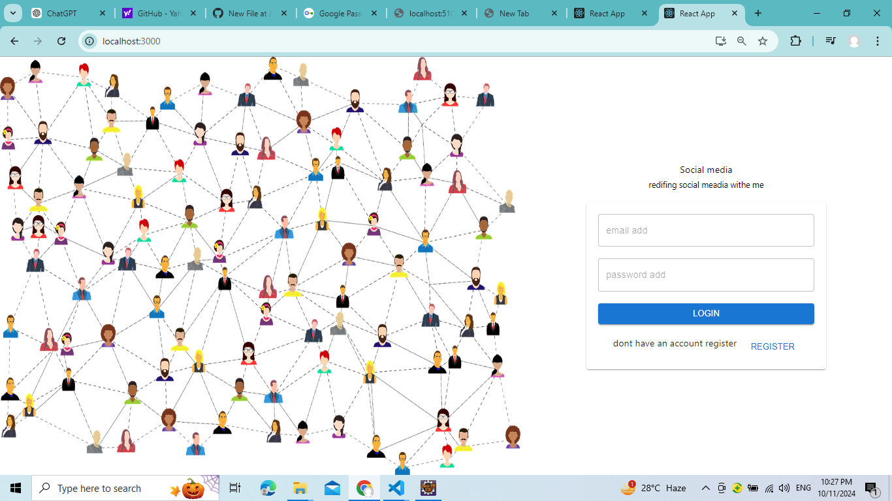
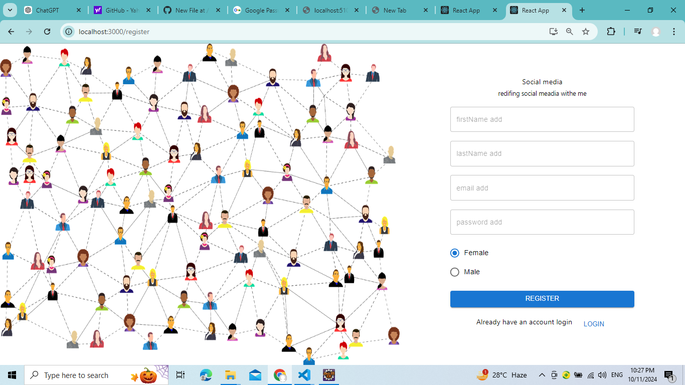
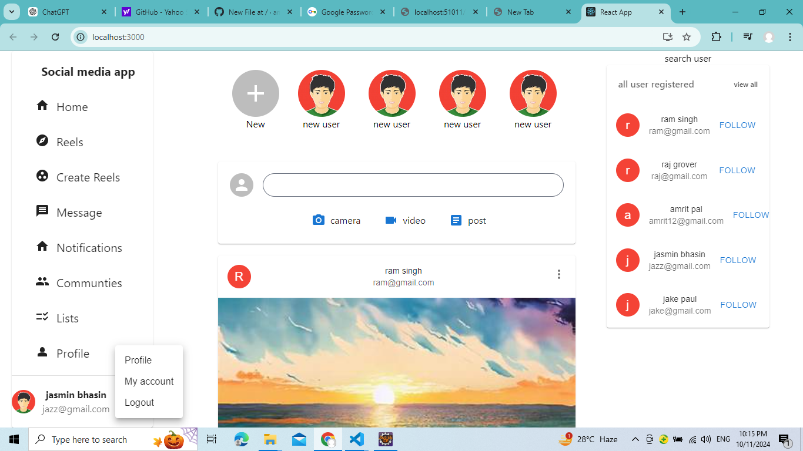
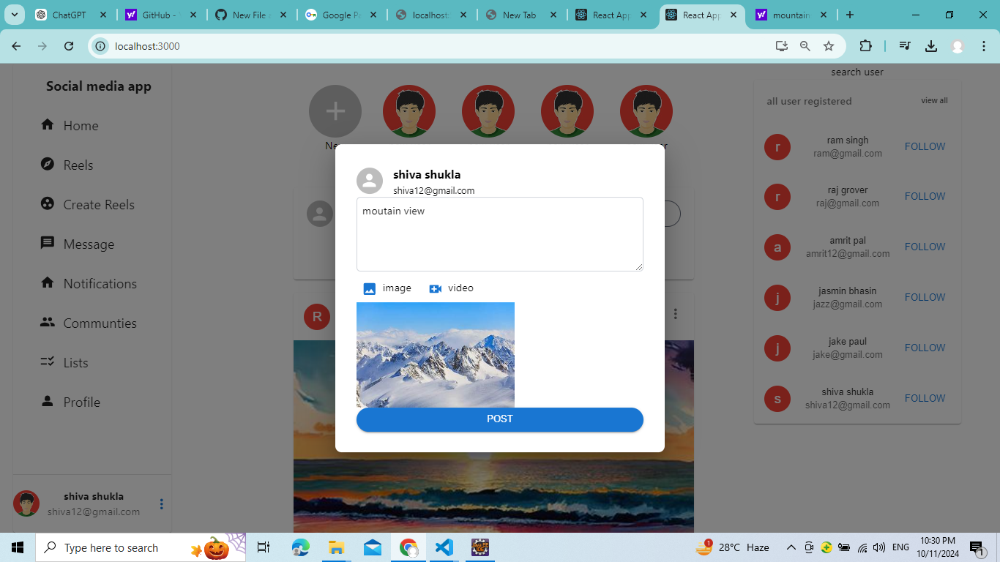
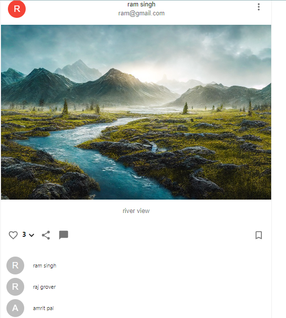
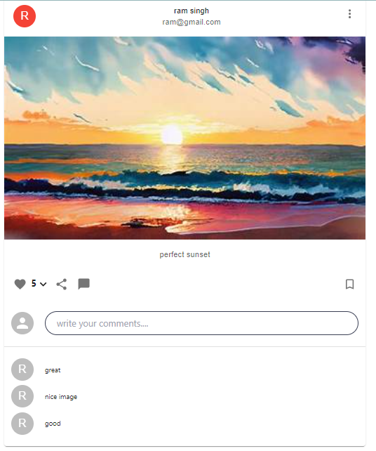

# Social Media App

This is a social media application that allows users to register, log in, create posts, like posts, and comment on posts using JWT authentication.

## Table of Contents
- [Features](#features)
- [Technologies Used](#technologies-used)
- [Application Overview](#application-overview)
- [Screenshots](#screenshots)

## Features
- **User Authentication**: Users can register and log in using JWT authentication.
- **Post Management**: 
  - Users can create posts by uploading pictures and writing captions.
  - Posts are displayed in a feed for all users to see.
- **Likes and Comments**:
  - Users can like posts made by other users.
  - Users can write comments on posts.
  - Users can see the total like count and the names of users who liked the post.
- **User List**: A sidebar displaying all registered users for easy interaction.

## Technologies Used
- **Frontend**: React, Redux, HTML, Tailwind CSS
- **Backend**: Spring Boot, Java, JWT for authentication
- **Database**: MySQL
- **Image Upload**: Cloudinary for storing images

## Application Overview
Upon logging in, users will see a feed of posts published by other users. They can view, like, and comment on posts. The sidebar displays a list of all registered users, enabling interactions within the platform.

### User Stories
1. As a user, I can register and log in securely.
2. As a user, I can create a post by uploading an image and adding a caption.
3. As a user, I can see the posts created by others in my feed.
4. As a user, I can like posts and view the names of other users who liked them.
5. As a user, I can comment on posts.

## Screenshots

### 1. Login Page

### 2. Register Page

### 2. User Feed

### 3. Create Post

### 4. Likes and Comments

